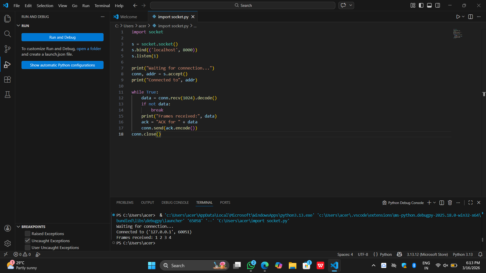
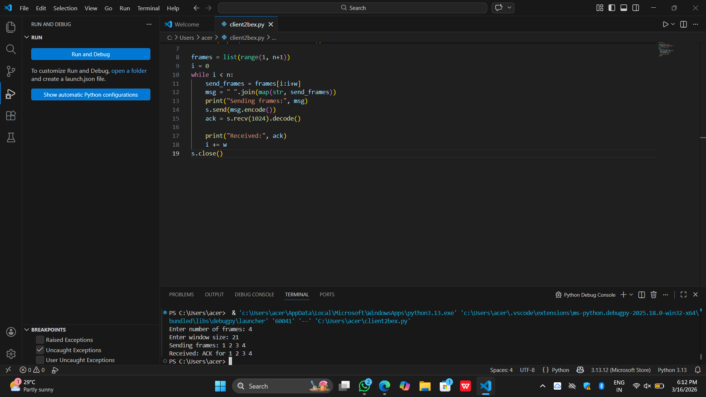

# 2b IMPLEMENTATION OF SLIDING WINDOW PROTOCOL
## AIM
To implement the Sliding Window mechanism to transmit data frames from the client to the server and receive acknowledgements (ACK) for reliable data communication.
## ALGORITHM:
1. Start the program.
2. Get the frame size from the user
3. To create the frame based on the user request.
4. To send frames to server from the client side.
5. If your frames reach the server it will send ACK signal to client
6. Stop the Program
## PROGRAM
```
server.py
import socket 

s = socket.socket() 
s.bind(('localhost', 8000)) 
s.listen(1) 

print("Waiting for connection...") 
conn, addr = s.accept() 
print("Connected to", addr) 

while True: 
    data = conn.recv(1024).decode() 
    if not data: 
        break 
    print("Frames received:", data) 
    ack = "ACK for " + data 
    conn.send(ack.encode()) 
conn.close()

client.py
import socket

s = socket.socket() 
s.connect(('localhost', 8000)) 
n = int(input("Enter number of frames: ")) 
w = int(input("Enter window size: ")) 

frames = list(range(1, n+1)) 
i = 0
while i < n: 
    send_frames = frames[i:i+w] 
    msg = " ".join(map(str, send_frames)) 
    print("Sending frames:", msg) 
    s.send(msg.encode()) 
    ack = s.recv(1024).decode() 

    print("Received:", ack) 
    i += w 
s.close()
```
## OUPUT


## RESULT
Thus, python program to perform stop and wait protocol was successfully executed
